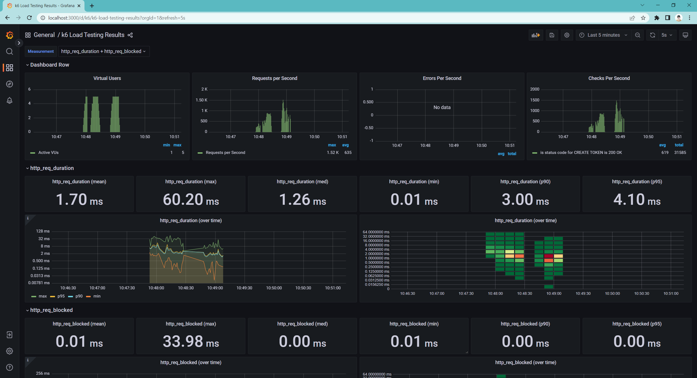

# k6-performance-framework

Scenarios to run load tests with containerised instances of K6, Grafana and InfluxDB. 

Application: https://github.com/auronsiow/oppenheimer-project-dev

## Getting started

### Prerequisites

Configuring local environment

- Install Docker - (For windows: Docker Desktop on Windows (https://docs.docker.com/desktop/windows/install/)
- Install k6 - https://k6.io/docs/getting-started/installation/

## Running the test

Run from powershell with these commands:

```
docker-compose up -d influxdb grafana
```

```
$env:K6_OUT="influxdb=http://localhost:8086/k6"
```

```
k6 run /scripts/oppenheimerProject/loadTestInsertDataScenario.js
```

## Check run time report generation on Grafana

Browse http://localhost:3000/d/k6/k6-load-testing-results?orgId=1&refresh=5s


